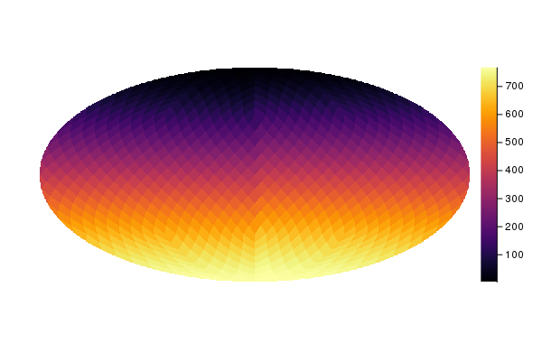
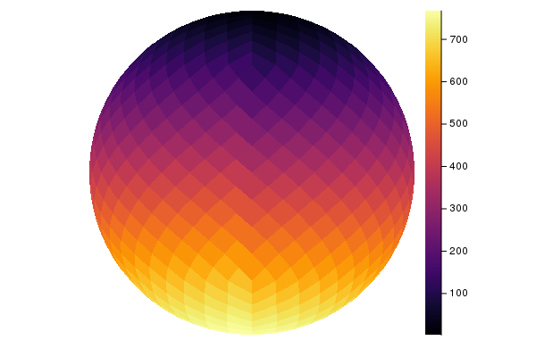

# Visualization functions

Healpix.jl uses RecipesBase to display maps. You need to import
`Plots` in order to display maps, using the `plot` functions.  Maps
are internally treated as heatmaps, so your backend should support
this kind of visualization: at the moment, this is true for GR, PlotLy
and PyPlot.


```@example plotting
using Healpix
using Plots
pyplot()  # hide

nside = 8
m = HealpixMap{Float64, RingOrder}(nside)
m.pixels[:] = 1:length(m.pixels)
plot(m)
savefig(joinpath("images", "mollweide.png")) # hide
```


A call to `plot` can provide two additional arguments:

1. A carthographic projection (see below).
2. A dictionary containing parameters to be used by the carthographic
   projection.
   
The following example displays the same map in orthographic
coordinates:

```@example plotting
plot(m, orthographic)
savefig(joinpath("images", "orthographic.png")) # hide
```



# Cartographic projections

Plotting is based on `project`, which takes a map as input and
produces a 2-D bitmap containing a representation of the map suitable
to be shown using [Plots](https://github.com/JuliaPlots/Plots.jl).

Although the easiest way to plot a map is to use `plot`, `project`
might be suitable in those cases where you are just interested in a 2D
bitmap. It requires a *inverse* projection function (mapping the 2D
plane to a point on the sphere) and the size of the bitmap, and it
returns three values:

- A 2-D bitmap containing the color level of each pixel. Unseen pixels
  (e.g., those falling outside the ellipse in a Mollweide projection)
  are marked as `NaN`, as well as unseen pixels;

- A 2-D bitmap of `Bool` values, telling which pixels in the map are
  masked, i.e., they are marked as `UNSEEN`, `NaN` or `missing` in the
  Healpix map;
  
- A `Bool` flag telling if there is any masked value in the mask (2nd
  return value, see above). This parameter is returned to optimize
  calls to `plot`, but it is obviously redundant.

Consider this example:

```@example project
using Healpix

m = HealpixMap{Float64, RingOrder}(1)
# Plot the map on a 20×20 bitmap using an
# equirectangular projection
image, mask, maskflag = project(equiprojinv, m, 20, 20)
```

A number of parameters can be passed to `project`, in order to taylor
the representation. They must **not** be passed as keyword arguments,
because this would clash with the way plot recipes work; instead, you
must use a dictionary:

```@example project
# Return a 2-D bitmap of 16-bit floating-point values
image, _, _ = project(equiprojinv, m, 20, 20,
                      Dict(:desttype => Float16))
```

The following dictionary keys are available:

- `:desttype`: type used for the pixels in the 2-D bitmap returned by
  `project`. Default is `Float32`;
  
- `:unseen`: the value marking pixels as unseen, i.e., masked. The
  default is `-1.6375e+30`, to preserve compatibility with other
  Healpix libraries.

- `:center`: currently this is used only with orthographic
  projections. It specifies the coordinates of the center of the image
  (colatitude and longitude, both in radians).

```@docs
project
```

## Projection functions

Functions [`mollweide`](@ref), [`equirectangular`](@ref), and
[`orthographic`](@ref) can be passed as parameters to `plot`.

```@docs
mollweide
equirectangular
orthographic
orthographic2
gnomonic
```

They are based on *inverse* projection functions, i.e., functions that
take a point in the plane ``[-1, 1] \times [-1, 1]`` and return a
tuple `(Bool, Number, Number)`, where the first Boolean is `true` if
the point falls within the projection, and the other two numbers are
the latitude and longitude in radians.

```@docs
mollweideprojinv
equiprojinv
orthoinv
ortho2inv
gnominv
```

The direct project functions are available too.

```@docs
equiproj
mollweideproj
```
